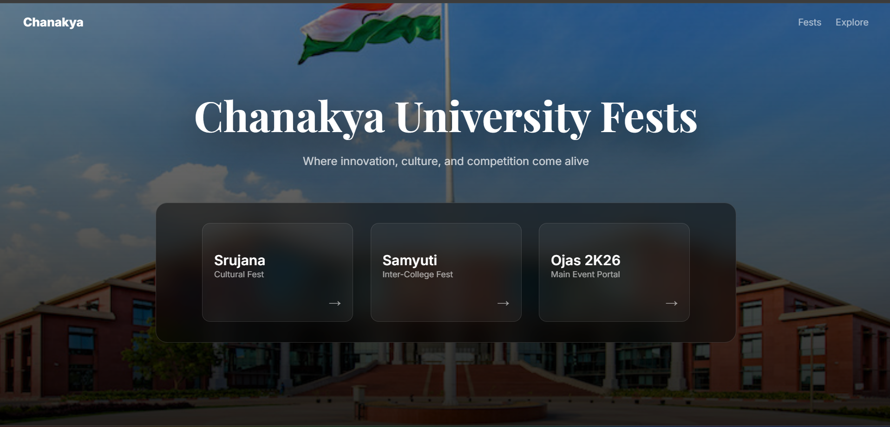
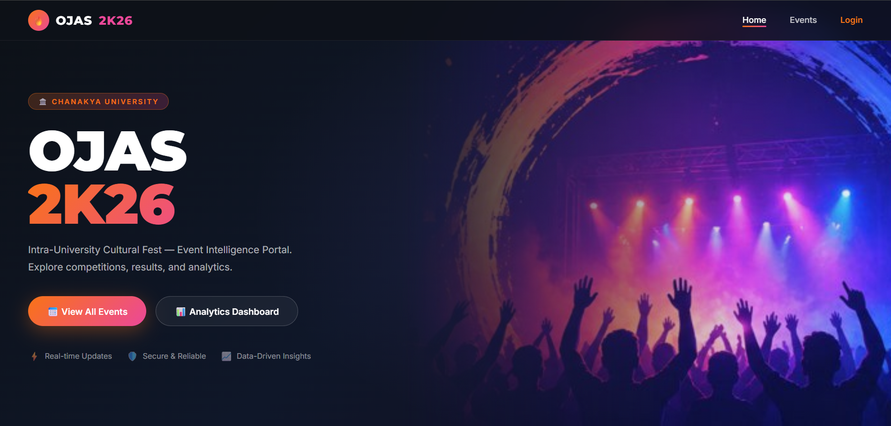
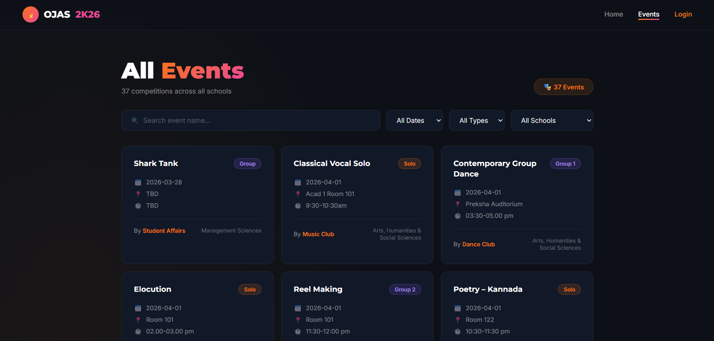
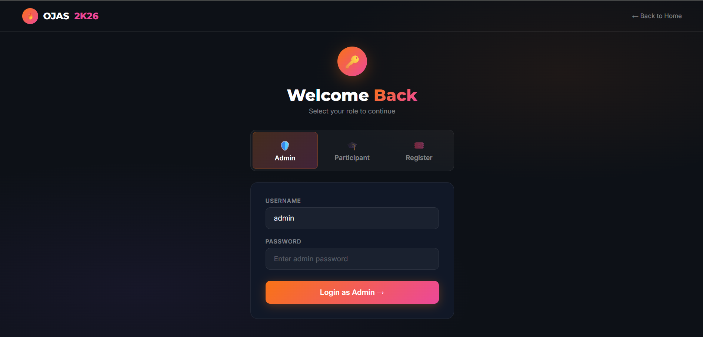
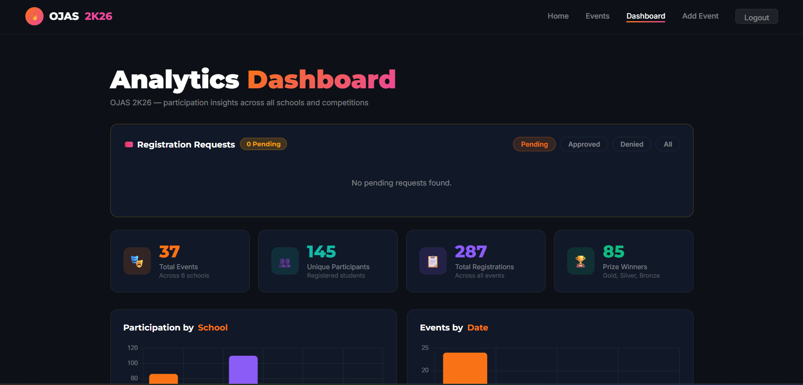

# 🎉 Chanakya University Fests Portal

A multi-fest event management web portal for **Chanakya University**, featuring three distinct fest sub-portals — **Ojas 2K26**, **Srujana**, and **Samyuti** — with student registration, event browsing, dashboards, and a Python backend connected to a Supabase database.

🌐 **Live Site:** [nagulkrish.github.io/Ojas_Project](https://nagulkrish.github.io/Ojas_Project/)

**Admin login details**
User Name - admin
Password - Admin@1234

---

## 🏛️ Fests

| Fest | Type | Description |
|------|------|-------------|
| **Ojas 2K26** | Main Event Portal | The primary university fest portal |
| **Srujana** | Cultural Fest | Arts, culture, and creative events |
| **Samyuti** | Inter-College Fest | Competitions open to other colleges |

---

## 📸 Screenshots







---

## ✨ Features

- 🎨 Animated glassmorphism landing page with smooth page transitions
- 🔐 Login & Registration for each fest
- 📋 Student dashboard to view registered events
- 📅 Events listing page
- ➕ Add-event functionality (admin)
- 🗄️ Supabase (PostgreSQL) database integration
- 🐍 Python backend deployed on Render

---

## 🛠️ Tech Stack

**Frontend**
- HTML5, CSS3, Vanilla JavaScript
- Google Fonts (Inter, Playfair Display)
- Glassmorphism UI design

**Backend**
- Python (`backend/app.py`)
- Supabase (PostgreSQL) via `supabase.js`
- Deployed on [Render](https://render.com)

---

## 📁 Project Structure

```
Ojas_Project/
│
├── index.html                  # Landing page (fest selector)
│
├── ojas_index.html             # Ojas 2K26 home
├── ojas_login.html
├── ojas_register.html
├── dashboard.html
├── events.html
├── add-event.html
├── student.html
│
├── srujana_index.html          # Srujana fest pages
├── srujana_login.html
├── srujana_register.html
├── srujana_dashboard.html
├── srujana_events.html
├── srujana_add-event.html
├── srujana_student.html
│
├── samyuti_index.html          # Samyuti fest pages
├── samyuti_login.html
├── samyuti_register.html
├── samyuti_dashboard.html
├── samyuti_events.html
├── samyuti_add-event.html
├── samyuti_student.html
│
├── backend/
│   ├── app.py                  # Python backend server
│   └── requirements.txt
│
├── images/                     # README screenshot images
├── supabase.js                 # Supabase client config
├── seed_events.js              # Script to seed event data
├── Sql_qu.sql                  # SQL queries
├── render.yaml                 # Render deployment config
└── bg.jpg / hero-bg.png        # Background images
```

---

## 🚀 Getting Started

### Prerequisites
- Python 3.x
- A [Supabase](https://supabase.com) account and project
- A [Render](https://render.com) account (for deployment)

### 1. Clone the repository
```bash
git clone https://github.com/nagulkrish/Ojas_Project.git
cd Ojas_Project
```

### 2. Set up the backend
```bash
pip install -r backend/requirements.txt
```

### 3. Configure environment variables

Create a `.env` file or set these in Render:

```
DB_HOST=your_supabase_host
DB_NAME=your_database_name
DB_USER=your_database_user
DB_PASSWORD=your_database_password
DB_PORT=5432
```

### 4. Run the backend locally
```bash
python backend/app.py
```

### 5. Open the frontend

Open `index.html` in your browser, or serve it with:
```bash
npx serve .
```

---

## ☁️ Deployment

This project uses **Render** for backend hosting. The `render.yaml` config handles:
- Runtime: Python
- Build command: `pip install -r backend/requirements.txt`
- Start command: `python backend/app.py`
- Environment variables (set manually in Render dashboard)

The frontend is hosted via **GitHub Pages**.

---

## 🗃️ Database

The project uses **Supabase** (PostgreSQL). The `Sql_qu.sql` file contains the table definitions and queries. To seed initial event data, run:

```bash
node seed_events.js
```

---

## 👥 Contributors

- [@nagulkrish](https://github.com/nagulkrish)

---

## 📄 License

This project is open source and available under the [MIT License](LICENSE).
